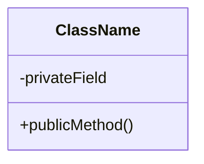

# Mermaid classDiagram 速查

## 基本區塊

````md

````

## 常見關係

| 語法 | 語意 |
|---|---|
| `A <|-- B` | B 繼承 A |
| `A <|.. B` | B 實作介面 A |
| `A --> B` | A 使用／依賴 B |
| `A *-- B` | A 組合 B（生命週期綁定） |
| `A o-- B` | A 聚合 B |

## 修飾

- `<<interface>>`、`<<abstract>>`、`<<enumeration>>` 放在 class 區塊第一行。
- 方法可省略參數與回傳型別，提案階段以可讀為主；實作時再補全。

## 注意

- 類別名避免空格；必要時用 `class "My Class" as MyClass`.
- 圖過大時拆成 2 張圖（例如 domain / delivery），並在提案中說明對應關係。
