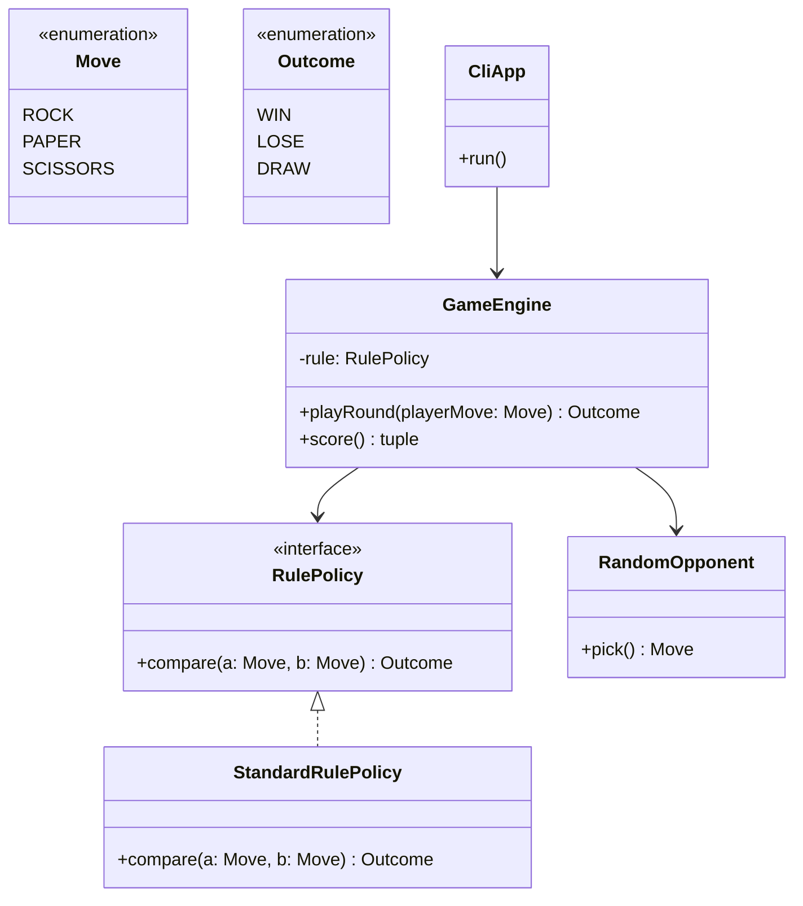

# 類別圖開發提案 — 命令列猜拳對戰

## 目標與驗收

使用者與電腦各出拳，依規則判勝負；可連續多回合並顯示比分。驗收：輸入合法拳種、非法輸入有提示、勝負與平手正確。

## 範圍

| In scope | Out of scope |
|---|---|
| 拳種、勝負規則、單機對電腦、CLI 互動 | 連線對戰、排行榜、持久化 |

## 假設

- Python 3.11+，單 process 記憶體狀態
- 電腦出拳使用 `random`，可注入種子供測試

## 類別圖（Mermaid）

## 設計摘要

- `RulePolicy` 便于日后替换规则（例如特殊赛制）。
- `GameEngine` 持有比分；`CliApp` 只负责 I/O。
- 拳種与结果用 enum，避免魔法字串。

## 同意後預計施工順序

1. `Move`、`Outcome` 枚举
2. `RulePolicy` 与 `StandardRulePolicy`
3. `RandomOpponent`
4. `GameEngine`
5. `CliApp` 与入口脚本

## 請確認

- [ ] **同意**依此類別圖開始實作
- [ ] **修訂**（請說明要改的類別／關係）
- [ ] **暫停**／僅保留類別圖、尚未要寫程式
